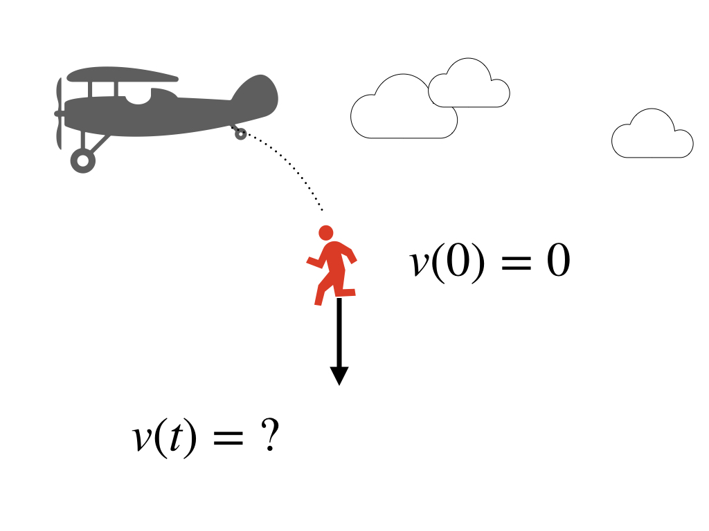
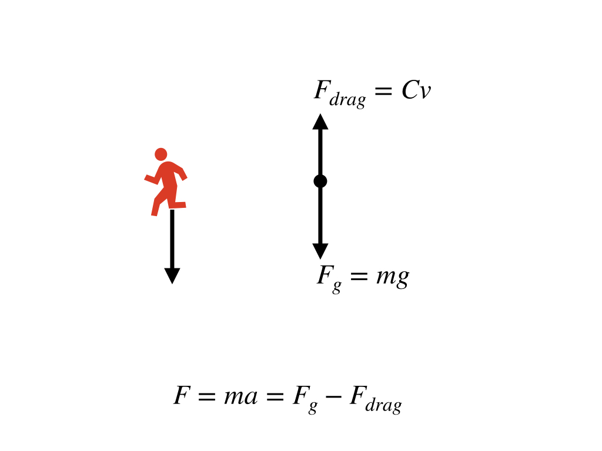

# 建模方法  {#modeling}
本章极少数值方法建模的基本方法论，涉及一些基础的建模思路和数学基础。

## 建模基本思路

1. 描述物理过程，形成概念模型（或认知模型）(Conceptual Model, or Mind Model)
1. 使用物理规律(Physical Laws)
1. 列出合理假设，简化问题 (Assumptions)
1. 使用数学公式表达物理规律和假设(Math equations)
1. 求解数学公式(Solver)

求解数学公式的过程，可以尝试寻找其解析解(Analytical solution)，也可以使用数值方法求得数值解(Numerical Solution)。

数值方法本质上是对离散（非连续）时空模型中因变量(Dependant variable)分布和变化的数学近似描述，从理论的解析解到数值解虽然损失了精度，但解析解通常无法求得，而数值方法可给出误差可接受的近似解。

### 案例：自由落体运动{-}

**描述** 
问题描述下图。



**问题**：任意$t>0$时刻的速度，即$v(t) = ?$。

建模步骤：

1. **认知模型**： 

    自由落体运动
    
2. **物理定律**： 

    牛顿定律： $F = ma$。
3. **假设**： 

    $v(t=0) = 0$ 
    
    且
    
    $F_{drag}(t) \propto v(t)$，即$F_{drag} = cv$。
4. **数学公式**： 
    
    由$F = ma$和$\frac{dv}{dt} = a$可得：
    
    $$\tag{1} \frac{dv}{dt} = a = \frac{F}{m}$$
    
    根据物体受力分析, 其受到向下的重力$F_{g} = mg$和向上的空气阻力$F_{drag} = cv$，空气阻力在此假设与物体运动速度成正比关系。则其受力平衡公式为：
    $$\tag{2} F = F_{g} - F_{drag} = mg - cv$$
    
    综合公式（1）和（2），则得到：
    $$\tag{3} \frac{dv}{dt} = g - \frac{c}{m} v$$
    
    

5. **公式求解**：

    初始条件：$v(0) = 0$
    
    积分求解(解析解)：
    $$v(t) = \frac {mg}{c}\left[ 1- exp(-\frac{c}{m}t) \right]$$
6. **结果绘图**：
```{r}
c = 15 # drag coeefficient
g = 9.8 # Gravity
m = 150  # Mass in kg
x = seq(0,100, 1)  # Time
y = m*g/c *(1 - exp(-1 * c / m * x))  # Vecocity
plot(x, y, type='l', xlab='Time (s)', ylab='Velocity (m/s)', col=2, lwd=2); 
grid()
```


*变量表:*

- $v(t)$ - 随时间变化的物体速度
- $m$ - 物体质量
- $g$ - 重力加速度
- $a$ - 物体运动的加速度
- $c$ - 空气阻力系数 
- $F$ - 物体所受的力
- $F_{g}$ - 重力
- $F_{drag}$ - 空气阻力


