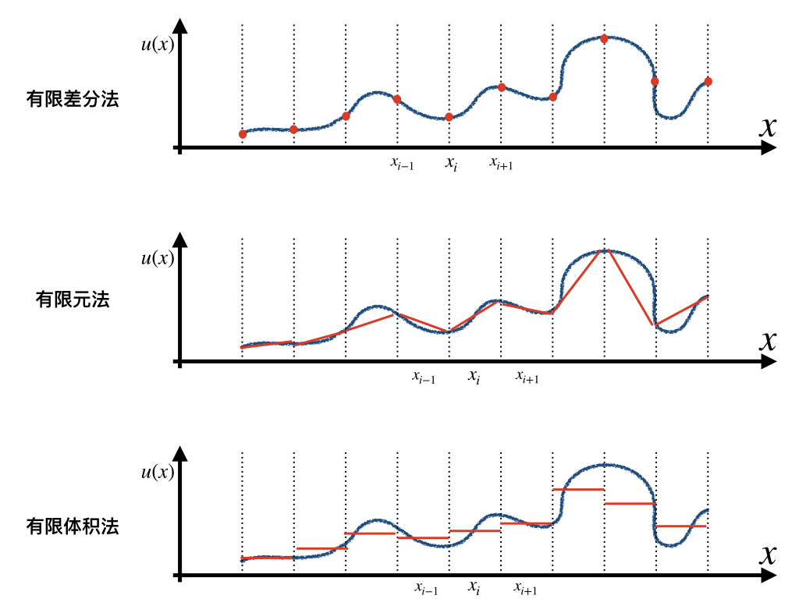
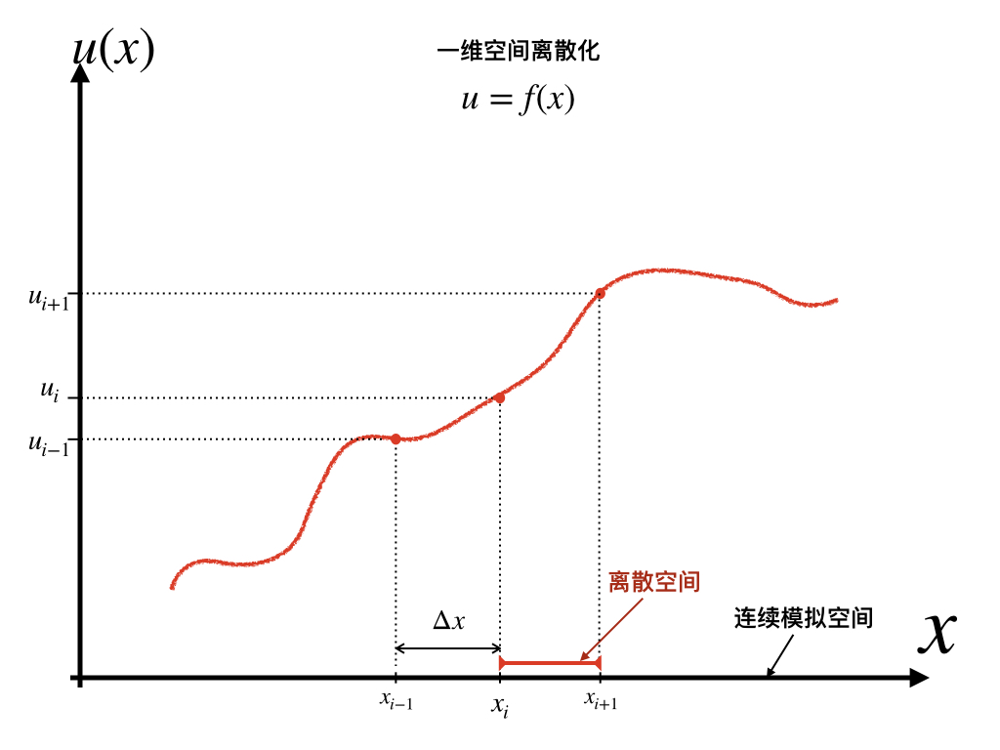
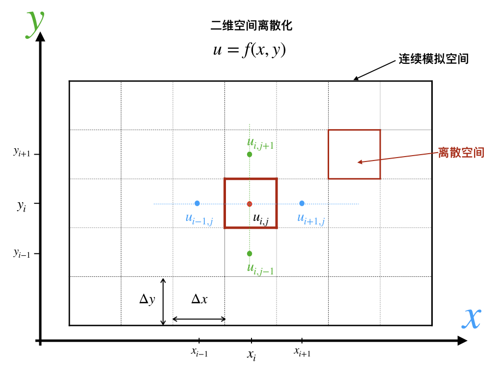
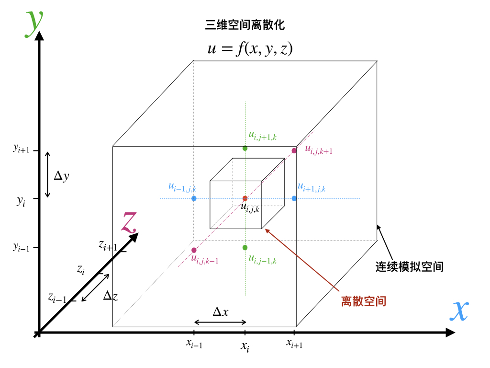
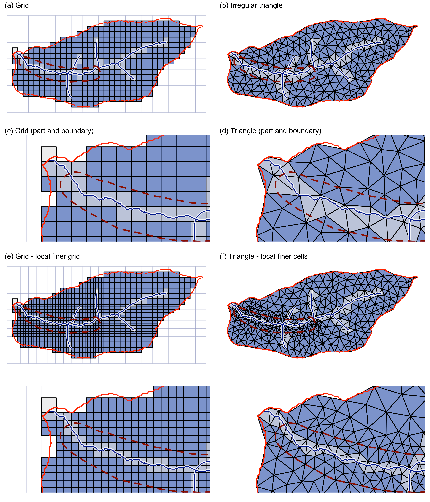

# 数值方法基础 {#nm}

## 隐式与显式求解法
数值方法可分为显式求解(Explicit method)与隐式求解(Implicit method)：

::: {.definition #dfex name="显式求解法"} 
当下一时刻变量由前一时刻变量直接计算得到的，称为显式求解法。数学表达可写为：
$$Y(t+\Delta t)=F(Y(t))$$
:::

::: {.definition #dfim name="隐式求解法"} 
当下一时刻变量由一系列公式、矩阵或者迭代算法计算得到，称为隐式求解法。数学表达可写为：
$$G(Y(t), Y(t+\Delta t))=0$$
:::


相同时空分辨率条件下，显式求解法的计算速度显著高于隐式求解法，但是隐式求解法可以保证计算的稳定性，因此可采用较大时间步长进行计算，而显式求解法必须受制于CFL条件。

## 数值迭代方法

### 牛顿迭代(Newton Iteration)
牛顿迭代法（Newton's method）又称为牛顿-拉夫逊（拉弗森）方法（Newton-Raphson method），是一种在实数域和复数域上近似求解方程的方法。方法使用函数 $f (x)$的泰勒级数的前面几项来寻找方程$f(x) = 0$的根。


### 欧拉方法(Euler Method)
在数学和计算机科学中，欧拉方法，命名自它的发明者萊昂哈德·歐拉，是一种一阶数值方法，用以对给定初值的常微分方程（即初值問題）求解。它是常微分方程數值方法中最基本的显式方法（Explicit method）。
欧拉方法是一个一阶方法，意味着其局部截断误差（每步误差）正比于步长的平方，并且其全局截断误差正比于步长。欧拉方法经常应用于作为构建一些更复杂方法的基础，例如，预估-校正方法。


***
:::{.definition name="欧拉方法"}
欧拉方法数学表达为:
  $$y^{\prime}(t)=f(t, y(t))$$
  $$y(t_0) = y_0$$
求解时：
$$y_{n+1} = y_n + h f(t_n, y_n)$$
其中$t_n = t0+nh$，$h$即迭代步长， $h = t_{n+1} - t _{n}$。
欧拉方法属于显式求解法。
:::
***


```{example, title="Euler Method"}
已知函数：
  $$\frac{dy}{dt} = y$$
  $$y(0)=1$$
**求**：$$y(4) = ?$$
```

```{r, code = readLines("Code/ch02/Euler-1.R")}
```

### 龙格-库塔方法(Runge-Kutta Method)
数值分析中，龙格-库塔方法（Runge-Kutta Methods）是用于非线性常微分方程的解的重要的一类隐式或显式迭代法。这些技术由数学家卡尔·龙格和马丁·威尔海姆·库塔于1900年左右发明。

这里介绍最常见的四阶龙格-库塔方法。


***
:::{.definition name="龙格-库塔方法"}
$$\frac{dy}{dx} = x^2 + y^2$$
$$f' = \frac {dy}{dx}$$
龙格-库塔方法求解过程为:
$$ k_1 <- h * f' (x_i, y_i)$$
$$k_2 <- h * f' (x_i + h/2, y_i + k_1/2)$$
    $$k_3 <- h * f' (x_i + h/2, y_i + k_2/2)$$
    $$k_4 = h * f' (x_i + h, y_i + k_3)$$
    $$y_{i+1} = y_i + (k_1 + 2*k_2 + 2*k_3 + k_4) / 6$$
$h$即迭代步长，
$h = x_{i+1} - x_i$。
:::
***

实现四阶龙格-库塔算法的R代码：

```{r, code = readLines("Code/ch02/rk4.R")}
```

### 皮卡法(Picard Method)
皮卡逐次逼近法（Picard Successive Approximation Method）是常微分方程解的一种主要近似计算方法。皮卡(Picard,(C.-)É)最早在数学上完善处理这样的逐次逼近的函数序列，所以称为皮卡逐次逼近法。


## 有限元, 有限差分 ,有限体积
数值方法中主要有有限差分（Finite Difference, FD）、有限元（Finite Element, FE）和有限体积（Finite Volume，FV）法三类。三类方法并无明显优劣之分，但其中各有特点。有限差分法方法简洁，物理意义清晰，编程容易，因而是水文/气象领域应用最多的方法。
有限元法可以保证全局物质/能量守恒，但是无法保证局部守恒；有限体积法弥补了有限元这一缺陷，既可以保证全局守恒，也可以保证局部守恒。

三类方法的数学的意义略有不同：有限差分法计算为空间某一点的值，有限元法计算某一计算单元内的近似拟合曲线，有限体积法作为有限元法的特例，计算该计算单元内的均值。因此对于三种不同方法计算的结果的解读应当略有不同，但实际模型用户层面通常将其视为相同含义。




## CFL条件约束

CFL条件是数值方法求解常/偏微分方程保证其收敛性和稳定性的**必要条件**，但不是充分条件；以Courant， Fredrichs和Lewy共同命名（cite）。CFL条件即数值方法的时间步长要足够小，方能够保证计算精度，否则结果不收敛或者不稳定。

最简单可以理解为时间推进求解的速度必须大于物理扰动传播的速度，只有这样才能将物理上所有的扰动俘获到。

:::{.definition name="CFL条件"}
CFL条件数学表达形式为：
$$ \frac {c \Delta t} {\Delta x ^n} < C_{max}$$
其中$c$即为系统中变量的变化速率。$C_{max}$是保持求解系统稳定和收敛的最大值，常见值为0.5。有的系统中$n=1$，但有的科学问题中$n>1$。
:::

## 时空离散化

空间离散化，即分割连续的空间称为空间若干子集的过程,由一维$\Delta x$, 二维$(\Delta x, \Delta y)$, 或者三维$(\Delta x, \Delta y, \Delta z)$构成的最小计算单元或质点。 

时间离散化即模型时间步长，即$\Delta t$。

时间步长和空间分辨率的组合关系，对于数值方法求解的稳定性和收敛性都有显著影响。CFL条件是限制因素。为保证数值方法稳定性，空间分辨率越高，则要求时间分辨率也越高，时间分辨率与空间分辨率的（一次或多次）幂存在正比关系。










通常的空间离散化分为结构化(Structured)与非结构化(Unstructured)网格。

结构化网格主要是划分为形状和面积相同的计算单元。矩形规则化网格的好处是：求解过程直观易懂，编程实现简单，并且易于并行化；输入和输出数据都直接使用矩阵方式表达；数据制备、处理和可视化都直观且便捷。规则化网格常见矩形，也有正三角形和正六边形的方案。

非结构化网格的优势在于：

1. 更好的表现不规则三维地形；
1. 更好的表现不规则研究区(流域）的边界，边界条件处理更合理，其边界条件控制也更符合数值理论；
1. 计算单元的面积大小灵活可变，可以在保证整体边界条件情况下，对重点地区进行局部加密——亦或相反设置。非结构化网格既可以保证重点区域的高分辨率，在保证可靠的边界条件情况下，不显著增加计算单元数量，保证重点区域模拟精度和计算负担之间的平衡。

非结构化网格的主要缺陷是：

1. 计算过程相对复杂，仅支持有限元和有限体积法；
1. 数据解读和可视化复杂，需要针对性的数据前处理和后处理软件。



## 初始条件

:::{.definition name="初始条件"}
初始条件定义为
  $$y(t_0) = y_0$$
  其中$t_0$为问题的初始时刻，$y_0$为初始时刻包含目标变量值的向量。
:::

数值方法研究中，模拟结果对初始条件具有一定敏感性。但是，初始条件的敏感性问题与描述该系统的控制方程有关。部分问题的初始条件误差，可以通过一定时间的模型预热(Spin-up)消除；但另有一部分问题（例如Lorenz System为代表的混沌系统），初始条件敏感性极高。

## 边界条件
数值方法的边界条件通常分为Dirichlet和Neumann两类。

:::{.definition name="第一类边界条件"}
Dirichlet边界条件(Dirichlet Boundary Condition, DBC)是常/偏微分方程的第一类边界条件，也称为固定边界条件，其指定了空间某点的固定值，比如在地下水中，Dirichlet边界条件限定固定地下水水头高度。
:::

:::{.definition name="第二类边界条件"}
诺伊曼边界条件（Neumann boundary condition, NBC) 也被称为常/偏微分方程的“第二类边界条件”，其给定空间特定位置上目标变量的一阶导数，在地下水问题中，通常某一点处固定的流量，如注水或者取水量。
:::


作为三维的数值模型，两类边界条件都可以施加在空间任意位置的任意方向上。


