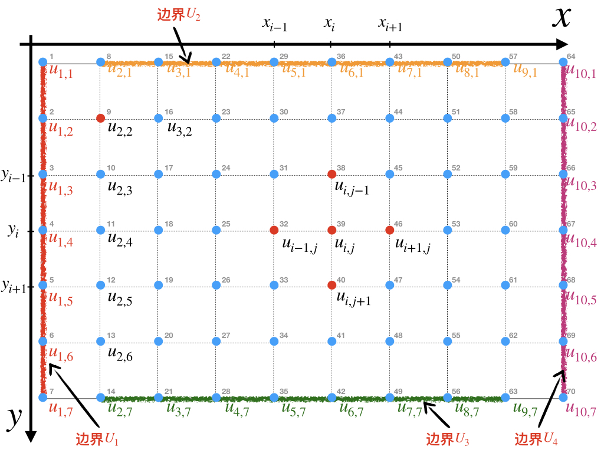

# 有限差分法 {#fdm}

## 泰勒展开式(Taylor Series)

在数学中，泰勒级数（英語：Taylor series）用无限项连加式——级数来表示一个函数，这些相加的项由函数在某一点的导数求得。泰勒级数是以于1715年发表了泰勒公式的英國数学家布魯克·泰勒（Sir Brook Taylor）来命名的。


泰勒展开式的基本形式：

\begin{equation}
f(x) = \sum_{k=0}^n  \frac{f^{(n)}(0) }{n!}( x) ^{n}
(\#eq:taylor0)
\end{equation}


根据泰勒展开式，通过$f(x)$和其任意阶的导数，可以获得任意$\Delta x$值下的函数值$f(x + \Delta x)$ ，即: 

\begin{equation}
f(x+\Delta x) = f(x) + \frac{f'(x)}{1!} \Delta x + \frac{f^{''}(x)}{2!} \Delta x^2 + \frac{f^{'''}(x)}{3!} \Delta x^3+\dotsb + \frac{f^{(n)}(x) }{n!}( \Delta x) ^{n}
(\#eq:dt)
\end{equation}

或者在$-\Delta x$位置，可写为：

\begin{equation}
f(x-\Delta x) = f(x) - \frac{f'(x)}{1!} \Delta x + \frac{f^{''}(x)}{2!} \Delta x^2 - \frac{f^{'''}(x)}{3!} \Delta x^3+\dotsb + \frac{f^{(n)}(x) }{n!}(- \Delta x) ^{n}
(\#eq:dt-)
\end{equation}

以上公式也可以写为：
\begin{equation}
u_{i+1} = u_{i} + \frac{u^{'}_{i}}{1!} \Delta x + \frac{u^{''}_{i}}{2!} \Delta x^2 + \frac{u^{'''}_{i}}{3!} \Delta x^3+\dotsb + \frac{u^{(n)}_{i} }{n!}( \Delta x) ^{n}
(\#eq:udt)
\end{equation}

\begin{equation}
u_{i-1} = u_{i} - \frac{u^{'}_{i}}{1!} \Delta x + \frac{u^{''}_{i}}{2!} \Delta x^2 - \frac{u^{'''}_{i}}{3!} \Delta x^3+\dotsb + \frac{u^{(n)}_{i} }{n!}(- \Delta x) ^{n}
(\#eq:udt-)
\end{equation}

在此，我们需要引入**截断误差（truncation error）**的概念，数学表达为$O()$。 $O(2)$和$O(3)$分别表示为在泰勒展开式上的二阶和三阶导数上的误差。**截取误差的阶数越高，误差越小**。

$$O(1) = \frac{u^{''}_{i}}{2!} \Delta x^2+\frac{u^{'''}_{i}}{3!} \Delta x^3+\frac{u^{(4)}_{i}}{4!} \Delta x^4+\dotsb + \frac{u^{(n)}_{i} }{n!}( \Delta x) ^{n}$$

$$O(2) = \frac{u^{'''}_{i}}{3!} \Delta x^3+\dotsb + \frac{u^{(n)}_{i} }{n!}( \Delta x) ^{n}$$
$$O(3) = \frac{u^{(4)}_{i}}{4!} \Delta x^4+\dotsb + \frac{u^{(n)}_{i} }{n!}( \Delta x) ^{n}$$


**何种情况下，泰勒展开式的截断误差为0？**

- $O(0) = 0$ 时，意味着：$f(x+\Delta x) = f(x)$。则该函数为$f(x) = C$, $C$为常数。
如图：


- $O(1) = 0$ 时，意味着：$f(x+\Delta x) = f(x) + f^{'}(x) \cdot \Delta x$。则该函数为$f(x) = ax + b$。
如图：


**如何依据泰勒级数，得到函数的一阶和二阶导数？**

### 一阶导数

#### 向前估计 (Forward Approximation)

采纳一阶截断误差，我们可将公式\@ref(eq:dt)写为：
\begin{equation}
f(x+\Delta x) = f(x) + \frac{f'(x)}{1!} \Delta x + O(1)
\end{equation}
则：
\begin{equation}
 f'(x) = \frac {f(x+\Delta x) - f(x) } {\Delta x} 
(\#eq:d1f)
\end{equation}
或者
\begin{equation}
 u'_{i} = \frac {u_{i+1} - u_{i} } {\Delta x} 
(\#eq:d1f)
\end{equation}

*注：公式\@ref(eq:d1f)隐含了$O(1)$的误差。*


#### 向后估计 (Backward Approximation)

采纳一阶截断误差，我们可将公式\@ref(eq:dt-)写为：
\begin{equation}
f(x-\Delta x) = f(x) - \frac{f'(x)}{1!} \Delta x + O(1)
\end{equation}
则：
\begin{equation}
 f'(x) = \frac {f(x) -f(x-\Delta x) } {\Delta x} 
(\#eq:d1b)
\end{equation}
或者
\begin{equation}
 u'_{i} = \frac { u_{i} - u_{i-1}} {\Delta x} 
(\#eq:d1b)
\end{equation}

*注：公式\@ref(eq:d1b)隐含了$O(1)$的误差。*


#### 中心估计 (Central Approximation)

中心估计算法中，我们将从公式\@ref(eq:dt)减去公式\@ref(eq:dt-)，得到：
$$
f(x+\Delta x)  - f(x-\Delta x) = 0 + 2 * \frac{f'(x)}{1!} \Delta x + 0 + 2 * \frac{f^{'''}(x)}{3!} + ...
$$

截断误差由以上公式右边的第四项（三阶导数）开始，则该公式的截取误差为$O(2)$，即二阶精度的截取误差，公式表达为：
$$
f(x+\Delta x)  - f(x-\Delta x) = 0 + 2 * \frac{f'(x)}{1!} \Delta x + 0 + O(2)
$$
可得到二阶精度的一阶导数的中心估计：
\begin{equation}
 f'(x) = \frac {f(x+\Delta x) -f(x-\Delta x) } {2\Delta x} 
(\#eq:d1c)
\end{equation}
或者
\begin{equation}
 u'_{i} = \frac { u_{i+1} - u_{i-1}} {2\Delta x} 
(\#eq:d1c)
\end{equation}

公式\@ref(eq:d1c)隐含了$O(2)$的误差，同时\@ref(eq:d1f)和\@ref(eq:d1b)都隐含了$O(1)$的误差。


### 二阶导数

我们将公式 \@ref(eq:dt)和\@ref(eq:dt-)相加，可得到：

\begin{equation}
f(x+\Delta x) + f(x-\Delta x) = 2 \cdot f(x) + 0  + 2 \cdot \frac{f^{''}(x)}{2!} \Delta x^2 + 0 + 2 \cdot \frac{f^{(4)}(x)} {4!} \Delta x^4 + \dotsb 
(\#eq:d2)
\end{equation}

公式\@ref(eq:d2)来自公式 \@ref(eq:dt)和\@ref(eq:dt-)的相加，三阶导数项在相加过程中为零，因此我们截取其三阶截取误差，则公式\@ref(eq:d2)可写为：
\begin{equation}
f(x+\Delta x) + f(x-\Delta x) = 2f(x) + f^{''}(x) \Delta x^2 + O(3)
(\#eq:d2oo)
\end{equation}


根据公式\@ref(eq:d2oo)，我们可获得函数$f(x)$在$x$位置的二阶导数为：

\begin{equation}
f^{''}(x) = \frac { f(x+\Delta x) - 2f(x)  + f(x-\Delta x) } { \Delta x^2 } + O(3)
(\#eq:d2o)
\end{equation}

当移除其三阶截断误差$O(3)$后，我们得到近似的二阶导数：

\begin{align}
f^{''}(x) & \approx \frac {1}{ \Delta x } \left( \frac{ f(x+\Delta x) - f(x) }{ \Delta x }  + \frac{ f(x) - f(x-\Delta x) } { \Delta x } \right) \\
    & \approx \frac { f(x+\Delta x) - 2f(x)  + f(x-\Delta x) } { \Delta x^2 }
(\#eq:d2o3)
\end{align}

将公式一般化，我们可写为以下形式：

\begin{align}
u^{''}_{i} &\approx \frac {1}{ \Delta x } \left( \frac{u_{i+1} - u_{i}}{\Delta x} - \frac{u_{i} - u_{i-1}}{\Delta x} \right) \\
 & \approx \frac { u_{i+1} - 2u_{i}  + u_{i-1}  } { \Delta x^2 } \\
(\#eq:d2o3)
\end{align}


## 构建数值方法

```{example title="Heat Transfer"}

一根100$cm$长的铁棍，初始温度25 $^\circ C$，在其左右两边分别持续施加100$^\circ C$和$50 ^\circ C$的温度。
**求解**：任意时刻铁棍的温度分布。
```


参考信息：

- [wiki:Thermal_diffusivity](https://en.wikipedia.org/wiki/Thermal_diffusivity)
- [wiki:Heat_equation](https://en.wikipedia.org/wiki/Heat_equation)

1. **问题描述**

    空间微分，如图。
    

1. **物理定理**

    能量守恒：  
    能量变化 = 能量流入 - 能量流出
    $$ \Delta E = Q _{in} - Q _{out} $$
    
1. **控制方程**

    $$ 通量 = \frac {量}{单位时间 \cdot 单位面积} $$
    
    - $k$ - 热传导率[$W m^{-1} K ^{-1}$]。
    - $c$ - 比热容(specific heat capacity)[$J {kg}^{-1} K ^{-1}$]。
    - $\rho$ - 密度[${kg} m^{-3}$]。
    - $A$ -  截面积[$m^2$]。
    - $D$ - 热力学扩散度（Thermal diffusivity）$D = \frac{k}{\rho c}$ [$m^2 s^{-1}$]。

    $$ \rho * c * \Delta x * A * \Delta u = q_{in} * A * \Delta t - q_{out} * A * \Delta t$$
    两边同时除以$\rho c \Delta x A$，得到
    $$\frac {\Delta u}{\Delta t} = \frac{1}{\rho c} \frac{q_{in} - q_{out}}{\Delta x}$$
    以上公式当$\Delta x$趋近与0，$\Delta t$趋近于0时，得到微分形式：
    $$\frac {\partial u}{\partial t} = \frac{1}{\rho c} \frac{\partial q} {\partial x}$$

    $$q = k \frac{\partial u}{\partial x}$$
    则得到其控制方程：
    \begin{equation}
    \begin{aligned}
    \frac {\partial u}{\partial t} &= \frac{1}{\rho c} \frac{\partial q} {\partial x} \\
     &= \frac{1}{\rho c} \frac{k \frac{\partial u}{\partial x} } {\partial x} \\
     &= D\frac{\partial } {\partial x} \left(\frac{\partial u}{\partial x}  \right)
    \end{aligned}
    \end{equation}
    
    令$D=\frac{k}{\rho c}$，单位[$ m s^{-2}$]，则最终控制方程写为
    
    \begin{equation}
    \frac {\partial u}{\partial t} =D\frac{\partial ^2 u} {\partial x^2}
    (\#eq:heatge)
    \end{equation}
    

1. **时空离散化**

    由一阶泰勒级数可知，控制方程\@ref(eq:heatge)左边可写为：
    $$\frac {\partial u}{\partial t}  = D\frac{u^{t}_{i} - u^{t-1}_{i} }{\Delta t} + O(1)$$
    控制方程\@ref(eq:heatge)左边可写为：
    \begin{equation}
    \frac{\partial ^2 u} {\partial x^2} =\frac{u^{t-1}_{i+1} - 2u^{t-1}_{i} + u^{t-1}_{i-1} }{\Delta x} + O(3)
    \end{equation}
    或者
    \begin{equation}
    \frac{\partial ^2 u} {\partial x^2} =\frac{u^{t}_{i+1} - 2u^{t}_{i} + u^{t}_{i-1} }{\Delta x} + O(3)
    \end{equation}
    
    此时，方程左边在时间尺度上具有一阶截取误差$O(1)$，方程右边在空间尺度上具有三阶截断误差$O(3)$。省去误差项，离散化后控制方程写为：
    \begin{equation}
    \frac{u^{t}_{i} - u^{t-1}_{i} }{\Delta t} = D \frac{u^{t-1}_{i+1} - 2u^{t-1}_{i} + u^{t-1}_{i-1} }{\Delta x ^2} 
    (\#eq:heatTSex)
    \end{equation}
    或者
    \begin{equation}
    \frac{u^{t}_{i} - u^{t-1}_{i} }{\Delta t} = D \frac{u^{t}_{i+1} - 2u^{t}_{i} + u^{t}_{i-1} }{\Delta x ^2} 
    (\#eq:heatTSim)
    \end{equation}
    
1. **求解**


## 显式求解法
显式求解法以公式\@ref(eq:heatTSex)作为起点，该公式可变形为：
$$
u^{t}_{i} - u^{t-1}_{i}  = \frac{D \Delta t}{{\Delta x}^2} \left(  u^{t-1}_{i+1} - 2u^{t-1}_{i} + u^{t-1}_{i-1}  \right) 
$$
令$\alpha = \frac{D \Delta t}{\Delta x^2}$, $\beta = 1 - 2\alpha$，整理以上公式可得：

\begin{equation}
\begin{aligned}
u^{t}_{i} - u^{t-1}_{i}  &= \alpha \left(  u^{t-1}_{i+1} - 2u^{t-1}_{i} + u^{t-1}_{i-1}  \right) \\
u^{t}_{i}  &= \alpha  u^{t-1}_{i+1} + (1- 2\alpha) u^{t-1}_{i} + \alpha u^{t-1}_{i-1}  \\
u^{t}_{i}  &= \alpha  u^{t-1}_{i+1} + \beta u^{t-1}_{i} + \alpha u^{t-1}_{i-1} 
\end{aligned}
\end{equation}


将以上公式应用于离散点上，

| 点号 $i$ | 公式 |
|:------:|:---------:|
| 1 | 边界条件: $u^{t}_{1}  = U_{0}$ |
| 2 | $u^{t}_{2}  = \alpha  u^{t-1}_{3} + \beta u^{t-1}_{2} + \alpha u^{t-1}_{1}$  |
| 3 | $u^{t}_{3}  = \alpha  u^{t-1}_{4} + \beta u^{t-1}_{3} + \alpha u^{t-1}_{2}$  |
| 4 | $u^{t}_{4}  = \alpha  u^{t-1}_{5} + \beta u^{t-1}_{4} + \alpha u^{t-1}_{3}$  |
| 5 | $u^{t}_{5}  = \alpha  u^{t-1}_{6} + \beta u^{t-1}_{5} + \alpha u^{t-1}_{4}$  |
| ... | ... |
| i-1 | ... |
| i | $u^{t}_{i}  = \alpha  u^{t-1}_{i+1} + \beta u^{t-1}_{i} + \alpha u^{t-1}_{i-1}$ |
| i+1| ... |
| ... | ... |
| n-2 | $u^{t}_{n-2}  = \alpha  u^{t-1}_{n-1} + \beta u^{t-1}_{n-2} + \alpha u^{t-1}_{n-3}$ |
| n-1 | $u^{t}_{n-1}  = \alpha  u^{t-1}_{n} + \beta u^{t-1}_{n-1} + \alpha u^{t-1}_{n-2}$ |
| n | 边界条件: $u^{t}_{n}  = U_{L}$|

由此我们得到$n$个算式，可转换为矩阵形式：

\begin{equation}
\begin{bmatrix}
u_{1}^{t} \\ u_{2}^{t} \\ u_{3}^{t} \\ u_{4}^{t} \\
\dots \\ u_{i}^{t} \\  \dots \\ u_{n-3}^{t} \\
u_{n-2}^{t} \\ u_{n-1}^{t} \\  u_{n}^{t} \end{bmatrix}
= 
\begin{bmatrix}
    {\color{red}1}     & 0 & 0 & 0 & \dots & 0  & 0  & 0   & 0\\
    \alpha      & ~\beta~ & \alpha & 0 & \dots & 0  & 0  & 0   & 0\\
    0 & \alpha      & ~\beta~ ~& \alpha & \dots & 0  & 0  & 0   & 0\\
    \dots &\dots &\dots &\dots &\dots &\dots &\dots &\dots &\dots \\
    0 & 0    & \dots  & \alpha  & ~\beta~& \alpha & \dots & 0   & 0\\
    \dots &\dots &\dots &\dots &\dots &\dots &\dots &\dots &\dots \\
    0   & 0& 0  & 0  &  \dots &  \alpha~&  ~\beta~ &  \alpha  & 0  \\
    0   & 0& 0  & 0  &  \dots &  0 &   \alpha & ~\beta~ & \alpha   \\
    0   & 0& 0  & 0  &  \dots &  0 &   0&  0 &{\color{red}1}   
\end{bmatrix}

\begin{bmatrix}
U_{0} \\ u_{2}^{t-1} \\ u_{3}^{t-1} \\ u_{4}^{t-1} \\
\dots \\ u_{i}^{t-1} \\ \dots \\
u_{n-3}^{t-1} \\ u_{n-2}^{t-1} \\ u_{n-1}^{t-1} \\ U_{L}
\end{bmatrix} 
\end{equation}

更简洁的方式，可写为：

\begin{equation}
\begin{bmatrix}
u_{1} \\ u_{2} \\ u_{3} \\ u_{4} \\
\dots \\ u_{i} \\  \dots \\ u_{n-3} \\
u_{n-2} \\ u_{n-1} \\  u_{n} \end{bmatrix} ^{t}
= 
\begin{bmatrix}
    {\color{red}1}     & 0 & 0 & 0 & \dots & 0  & 0  & 0   & 0\\
    \alpha      & ~\beta~ & \alpha & 0 & \dots & 0  & 0  & 0   & 0\\
    0 & \alpha      & ~\beta~ ~& \alpha & \dots & 0  & 0  & 0   & 0\\
    \dots &\dots &\dots &\dots &\dots &\dots &\dots &\dots &\dots \\
    0 & 0    & \dots  & \alpha  & ~\beta~& \alpha & \dots & 0   & 0\\
    \dots &\dots &\dots &\dots &\dots &\dots &\dots &\dots &\dots \\
    0   & 0& 0  & 0  &  \dots &  \alpha~&  ~\beta~ &  \alpha  & 0  \\
    0   & 0& 0  & 0  &  \dots &  0 &   \alpha & ~\beta~ & \alpha   \\
    0   & 0& 0  & 0  &  \dots &  0 &   0&  0 &{\color{red}1}   
\end{bmatrix}

\begin{bmatrix}
U_{0} \\ u_{2} \\ u_{3} \\ u_{4} \\
\dots \\ u_{i} \\ \dots \\
u_{n-3} \\ u_{n-2} \\ u_{n-1} \\ U_{L}
\end{bmatrix} ^{t-1}
\end{equation}

下一时刻($t$)的变量组成的向量$x$由一个矩阵$[A]$乘以已知的前一时刻($t-1$)的向量$b$获得，即：。
$$
x = [A] * b 
$$
由已知变量的矩阵求解未知变量的方法，称为**显式求解法**。

## 隐式求解法

显式求解法以公式\@ref(eq:heatTSim)作为起点，该公式可变形为：
$$
u^{t}_{i} - u^{t-1}_{i}  = \frac{D \Delta t}{{\Delta x}^2} \left(  u^{t}_{i+1} - 2u^{t}_{i} + u^{t}_{i-1}  \right) 
$$
令$\alpha = \frac{D \Delta t}{\Delta x^2}$, $\beta = -1 - 2\alpha$，整理以上公式可得：

\begin{equation}
\begin{aligned}
u^{t}_{i} - u^{t-1}_{i}  &= \alpha \left(  u^{t}_{i+1} - 2u^{t}_{i} + u^{t}_{i-1}  \right) \\
-u^{t-1}_{i}  &= \alpha  u^{t}_{i+1} + (-1- 2\alpha) u^{t}_{i} + \alpha u^{t}_{i-1}  \\
-u^{t-1}_{i}  &= \alpha  u^{t}_{i+1} + \beta u^{t}_{i} + \alpha u^{t}_{i-1} 
\end{aligned}
\end{equation}


将以上公式应用于离散点上，

| 点号 $i$ | 公式 |
|:------:|:---------:|
| 1 | 边界条件: $u^{t-1}_{1}  = U_{0}$ |
| 2 | $-u^{t-1}_{2}  = \alpha  u^{t}_{3} + \beta u^{t}_{2} + \alpha u^{t}_{1}$  |
| 3 | $-u^{t-1}_{3}  = \alpha  u^{t}_{4} + \beta u^{t}_{3} + \alpha u^{t}_{2}$  |
| 4 | $-u^{t-1}_{4}  = \alpha  u^{t}_{5} + \beta u^{t}_{4} + \alpha u^{t}_{3}$  |
| 5 | $-u^{t-1}_{5}  = \alpha  u^{t}_{6} + \beta u^{t}_{5} + \alpha u^{t}_{4}$  |
| ... | ... |
| i-1 | ... |
| i | $-u^{t-1}_{i}  = \alpha  u^{t}_{i+1} + \beta u^{t}_{i} + \alpha u^{t}_{i-1}$ |
| i+1| ... |
| ... | ... |
| n-2 | $-u^{t-1}_{n-2}  = \alpha  u^{t}_{n-1} + \beta u^{t}_{n-2} + \alpha u^{t}_{n-3}$ |
| n-1 | $-u^{t-1}_{n-1}  = \alpha  u^{t}_{n} + \beta u^{t}_{n-1} + \alpha u^{t}_{n-2}$ |
| n | 边界条件: $u^{t-1}_{n}  = U_{L}$|


由此我们得到$n$个算式，可转换为矩阵形式：

\begin{equation}
\begin{bmatrix}
    {\color{red}1}     & 0 & 0 & 0 & \dots & 0  & 0  & 0   & 0\\
    \alpha      & ~\beta~ & \alpha & 0 & \dots & 0  & 0  & 0   & 0\\
    0 & \alpha      & ~\beta~ ~& \alpha & \dots & 0  & 0  & 0   & 0\\
    \dots &\dots &\dots &\dots &\dots &\dots &\dots &\dots &\dots \\
    0 & 0    & \dots  & \alpha  & ~\beta~& \alpha & \dots & 0   & 0\\
    \dots &\dots &\dots &\dots &\dots &\dots &\dots &\dots &\dots \\
    0   & 0& 0  & 0  &  \dots &  \alpha~&  ~\beta~ &  \alpha  & 0  \\
    0   & 0& 0  & 0  &  \dots &  0 &   \alpha & ~\beta~ & \alpha   \\
    0   & 0& 0  & 0  &  \dots &  0 &   0&  0 &{\color{red}1}   
\end{bmatrix}
\begin{bmatrix}
U_{0} \\ u_{2}^{t} \\ u_{3}^{t} \\ u_{4}^{t} \\
\dots \\ u_{i}^{t} \\ \dots \\
u_{n-3}^{t} \\ u_{n-2}^{t} \\ u_{n-1}^{t} \\ U_{L}
\end{bmatrix} 
= -
\begin{bmatrix}
u_{1}^{t-1} \\ u_{2}^{t-1} \\ u_{3}^{t-1} \\ u_{4}^{t-1} \\
\dots \\ u_{i}^{t-1} \\  \dots \\ u_{n-3}^{t-1} \\
u_{n-2}^{t-1} \\ u_{n-1}^{t-1} \\  u_{n}^{t-1} 
\end{bmatrix}

\end{equation}


更简洁的方式，可写为：

\begin{equation}
\begin{bmatrix}
    {\color{red}1}     & 0 & 0 & 0 & \dots & 0  & 0  & 0   & 0\\
    \alpha      & ~\beta~ & \alpha & 0 & \dots & 0  & 0  & 0   & 0\\
    0 & \alpha      & ~\beta~ ~& \alpha & \dots & 0  & 0  & 0   & 0\\
    \dots &\dots &\dots &\dots &\dots &\dots &\dots &\dots &\dots \\
    0 & 0    & \dots  & \alpha  & ~\beta~& \alpha & \dots & 0   & 0\\
    \dots &\dots &\dots &\dots &\dots &\dots &\dots &\dots &\dots \\
    0   & 0& 0  & 0  &  \dots &  \alpha~&  ~\beta~ &  \alpha  & 0  \\
    0   & 0& 0  & 0  &  \dots &  0 &   \alpha & ~\beta~ & \alpha   \\
    0   & 0& 0  & 0  &  \dots &  0 &   0&  0 &{\color{red}1}   
\end{bmatrix}

\begin{bmatrix}
U_{0} \\ u_{2} \\ u_{3} \\ u_{4} \\
\dots \\ u_{i} \\ \dots \\
u_{n-3} \\ u_{n-2} \\ u_{n-1} \\ U_{L}
\end{bmatrix} ^{t}
= -
\begin{bmatrix}
u_{1} \\ u_{2} \\ u_{3} \\ u_{4} \\
\dots \\ u_{i} \\  \dots \\ u_{n-3} \\
u_{n-2} \\ u_{n-1} \\  u_{n} \end{bmatrix} ^{t-1}
\end{equation}

一个矩阵$[A]$乘以下一时刻($t$)的变量组成的向量$x$等于已知的前一时刻($t-1$)的向量$b$，求解该方程则可得到$x$的值，数学表达为：

$$[A] * x = b$$

通用的求解法为
$$
x = [A]^{-1} * b
$$

通过已知变量、未知变量和矩阵组成的公式或函数来求解未知变量的过程，称为**隐式求解法**。

## 编程求解

**显式求解法**
```{r, code = readLines("Code/ch03/ch3_HeatTransferEx.R")}
xlab ='Distance (m)'
ylab = 'Temperature (C)'
x = HT.explicit(DX= 0.05, DT = 5, U0=100, UL=50, uic = 25)
plot1(x)
plot2(x)
```

**隐式求解法**

```{r, code = readLines("Code/ch03/ch3_HeatTransferIm.R")}
xlab ='Distance (m)'
ylab = 'Temperature (C)'
x = HT.implicit(DX= 0.05, DT = 1000, U0=100, UL=50, uic = 25, ignore.cfl=TRUE, plot=FALSE)
plot1(x, nout=10)

```


## 显式与隐式求解法对比

### CFL条件
```{r message=FALSE, warning=FALSE}
source("Code/ch03/ch3_HeatTransferIm.R")
xlab ='Distance (m)'
ylab = 'Temperature (C)'
x = HT.implicit(DX= 0.05, DT = 1000, U0=100, UL=50, uic = 25, ignore.cfl=TRUE, plot=FALSE)
plot1(x, nout=10)

```

### 计算效率

```{r}
source("Code/ch03/ch3_HeatTransferIm.R")
source("Code/ch03/ch3_HeatTransferEx.R")
Tmax = 1e4

t0 = Sys.time()
x=HT.explicit(DX= 0.025, DT = 5, U0=100, UL=50, uic = 25, X = 1, ignore.cfl=FALSE, plot=FALSE, Tmax=Tmax)
t1 = Sys.time()
tu.ex = t1 - t0

t0 = Sys.time()
x=HT.implicit(DX= 0.025, DT = 5, U0=100, UL=50, uic = 25, X = 1, ignore.cfl=FALSE, plot=FALSE, Tmax=Tmax)
t1 = Sys.time()
tu.im = t1 - t0

message('Time for implicit =', tu.im)
message('Time for explicit =', tu.ex)
```

## 二维有限差分


```{example title="承压地下水"}
$$
s  \frac{dh}{dt} = k_{x} B * \frac{d^2 h}{d x^2} + k_{y} B * \frac{d^2 h}{d y^2} + s_s
$$
```

令$D_x = \frac{k_x B}{s}$和$D_y = \frac{k_y B}{s}$。

公式推导：

右边：
$$\frac{\partial u}{\partial t} = \frac{u^{t+1}_{i, j} - u^{t}_{i, j} }{ \Delta t}$$

左边：

$$D_x\frac{\partial ^2 u}{\partial x^2} + D_y\frac{\partial ^2 u}{\partial y^2}= D_x\frac{u^{t}_{i+1, j} - 2 u^{t}_{i, j} + u^{t}_{i-1, j} }{ {\Delta x }^2} + D_y\frac{u^{t}_{i, j+1} - 2 u^{t}_{i, j} + u^{t}_{i, j-1} }{ {\Delta y }^2}$$

控制方程离散化后得到：
$$
\frac{u^{t+1}_{i, j} - u^{t}_{i, j} }{ \Delta t} = D_x\frac{u^{t}_{i+1, j} - 2 u^{t}_{i, j} + u^{t}_{i-1, j} }{ {\Delta x }^2} + D_y\frac{u^{t}_{i, j+1} - 2 u^{t}_{i, j} + u^{t}_{i, j-1} }{ {\Delta y }^2}
$$

$$u^{t+1}_{i, j} - u^{t}_{i, j}= \frac{D_x \Delta t}{ {\Delta x }^2} (u^{t}_{i+1, j} - 2 u^{t}_{i, j} + u^{t}_{i-1, j} ) +
\frac{D_x \Delta t}{ {\Delta y }^2} (u^{t}_{i, j+1} - 2 u^{t}_{i, j} + u^{t}_{i, j-1})$$

令$\alpha = \frac{D_x \Delta t}{ {\Delta x }^2}$, $\beta = \frac{D_x \Delta t}{ {\Delta y }^2}$, $\gamma = 1-2\frac{D_x \Delta t}{ {\Delta x }^2} - 2\frac{D_x \Delta t}{ {\Delta y }^2}$，公式变为：

$$
u^{t+1}_{i, j} = \alpha u^{t}_{i+1, j} + \beta u^{t}_{i, j+1} +  \gamma u^{t}_{i, j}  + \beta u^{t}_{i, j-1} + \alpha u^{t}_{i-1, j}
$$



假设$x$和$y$方向总长为$L_x$和$L_y$，沿两个方向的离散点数为$N_x =L_x / \Delta x$, $N_y =L_y / \Delta y$, $N = N_x * N_y$。 
矩阵形式可表达为：
$$ x = A * b $$

$$x = \begin{bmatrix}
\begin{bmatrix} u_{1,1} \\  \dots \\ u_{1, N_y} \end{bmatrix} \\ 
\begin{bmatrix} u_{2,1}   \\\dots \\  u_{2, N_y} \end{bmatrix} \\ 
\dots \\ u_{i,j} \\  \dots \\ 
\begin{bmatrix} u_{Nx, 1} \\ \dots\\  u_{N_x, N_y} \end{bmatrix}
\end{bmatrix} ^{t}$$

$$A = 
\begin{bmatrix}
\begin{bmatrix}
{\color{red}1}   & 0 & 0  \\
    0      & {\color{red}1} & 0 \\
    0      & 0 & {\color{red}1} 
\end{bmatrix} & 0 & 0 & 0 \\
0 & \begin{bmatrix}
{\color{red}1}   & 0 & 0  & 0 & 0 & 0 & 0\\
   \beta &  \dots &  \alpha     & {\gamma} & \alpha & \dots & \beta \\
    0      & 0 & 0      & 0 &0      & 0 & {\color{red}1} 
\end{bmatrix} & 0 & 0 \\
0 & 0 & \begin{bmatrix}
{\color{red}1}   & 0 & 0  & 0 & 0 & 0 & 0\\
   \beta &  \dots &  \alpha     & {\gamma} & \alpha & \dots & \beta \\
    0      & 0 & 0      & 0 &0      & 0 & {\color{red}1} 
\end{bmatrix} & 0  \\
0 & 0 & 0 & \begin{bmatrix}
{\color{red}1}   & 0 & 0  \\
   0     & {\color{red}1} & 0 \\
    0      & 0 & {\color{red}1} 
\end{bmatrix} \\
\end{bmatrix}
$$

$$b=
\begin{bmatrix}
[U_{1}]_{N_y*1} \\ 
\begin{bmatrix} U_2 \\ u_{2,1}   \\\dots \\  U_3 \end{bmatrix}_{N_y*1} \\ 
\begin{bmatrix} U_2 \\ u_{i,j}   \\\dots \\  U_3 \end{bmatrix}_{N_y*1} \\ 
[U_{4}]_{N_y*1}
\end{bmatrix} ^{t-1}$$


### 编程求解

**显式求解**


```{r, code = readLines("Code/ch03/ch3_ConfAq2DEx.R")}
```

```{r}
library(plot3D)
source("Code/ch03/ch3_ConfAq2DIm.R")
x = CA.Explicit(bc1 = c(10, 30,10, 10),
                uic = 25,
                Lxy = c(1000, 1000),
                Dxy = c(50,50),
                DD = rep(23 ,2),
                epsilon = 0.001,
                DT = 25,
                Tmax = 1000
                )
plot.3d(x)
```


**隐式求解**

```{r, code = readLines("Code/ch03/ch3_ConfAq2DIm.R")}
```

```{r}
library(plot3D)
source("Code/ch03/ch3_ConfAq2DIm.R")
x = CA.Implicit(bc1 = c(10, 30,10, 10),
                uic = 25,
                Lxy = c(1000, 1000),
                Dxy = c(50,50),
                DD = rep(23 ,2),
                epsilon = 0.001,
                DT = 25,
                Tmax = 1000
                )
plot.3d(x)
```

对比隐式与显式求解法的时间步长和效率：

```{r, code = readLines("Code/ch03/ch3_ConfAq2D_Versus.R")}
```