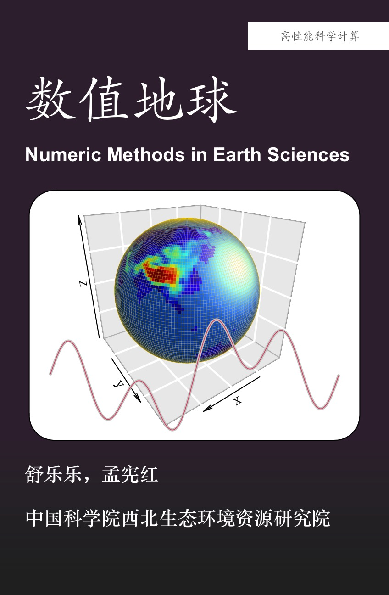

--- 
title:  "数值地球"
author: "舒乐乐，孟宪红"
date: "`r Sys.Date()`"
site: bookdown::bookdown_site
documentclass: book
bibliography: [book.bib, packages.bib]
url: https://shud.xyz/Book_NME
cover-image: image/Cover.jpg
description: 
  这是一本有关数值方法在地球科学应用的书，可以作为数值方法在大气、水文、地貌、地址和环境科学等方面的应用的入门教科书。
link-citations: yes
github-repo: rstudio/bookdown-demo
header-includes:
  - \usepackage{fontspec} # use fontspec package
  - \usepackage{xeCJK}    # use xeCJK package
---

# 绪论 {-}
```{r build cover, message=FALSE, warning=FALSE, include=FALSE}
source('Code/Cover.R')
```



这是一本有关数值方法在地球科学应用的书，可以作为数值方法在大气、水文、地貌、地质和环境科学等方面的应用的入门教科书。

书中会涉及以下内容：

1. 三种主要的数值方法：，包括有限差分(Finite Difference)、有限元(Finite Element)和有限体积法(Finite Volume)。
1. 数值方法的特征要点，包括初始条件(Initial condition)、边界条件(Boundary condition)和CFL条件(CFL condition)。
1. 数值方法在具体问题中的应用，包括大气、水文、水化学、地貌、地质等学科的案例。

```{r Logo, echo=FALSE, message=FALSE, warning=FALSE}
source('Code/Cover.R')
logo(resfac = 1)
```
